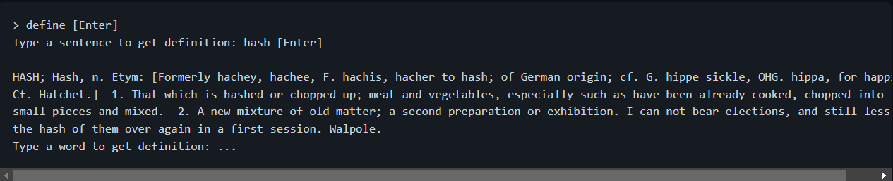

Розробити програму, яка на запит речення англійською мовою, видаватиме тлумачення кожного слова з цього речення або його переклад на іншу мову. Для цього найкраще буде використати структуру даних "хеш таблиця" (hash map, hash table, dictionary). Найпростіший спосіб зробити хеш таблицю – за допомогою масиву, в якому зберігаються зв'язні списки (linked list). Обидві структури треба написати власноруч. В простому варіанті завдання можна заздалегідь виділити достатньо пам'яті для таблиці.

Складніше завдання (+1 бал): Ви не знаєте наперед, скільки елементів буде зберігатися в таблиці. Хеш-таблиця має розширюватися в два рази і перебудовуватися, коли кількість доданих значень перевищує 80% від кількості комірок в таблиці. Це типова поведінка, що використовується в більшості стандартних бібліотеках. Зазвичай в текстах вказується швидкодія саме цього алгоритму.

Вхідні та вихідні дані
Ви можете використати готовий словник з цього файла (там 22 Мб тексту, в блокноті краще не відкривати). Оригінал.

Слова даються програмі на вхід через стандартний потік вводу. Наприклад, якщо ви скомпілюєте свою програму в define.exe:

Посилання
Відео лекції в MIT на тему хеш-таблиць
Wiki
Hash table з курсу прінстонського університету
Хороше пояснення на stackoverflow
Таблиці використовуються практично в будь-якій складній програмі. В базах даних їх використовують для швидкого пошуку полів, хоча часто використовують складніші B-дерева; в інтерпретованих мовах програмування для зберігання структур (ключами є назви змінних, значеннями – їхні значення); в ядрі Linux простіше сказати, де хеші не використовуються; хеш-таблиці є у більшості файлових систем, наприклад для реалізації індексних дескрипторів; для пошуку помилок у файлових системах; в алгоритмі Рабіна—Карпа для пошуку рядків, який в свою чергу часто використовується для пошуку плагіату.

*Написання алгоритму хеш-функції та структур linked list і hash table є обов'язковою умовою для здачі цього варіанту